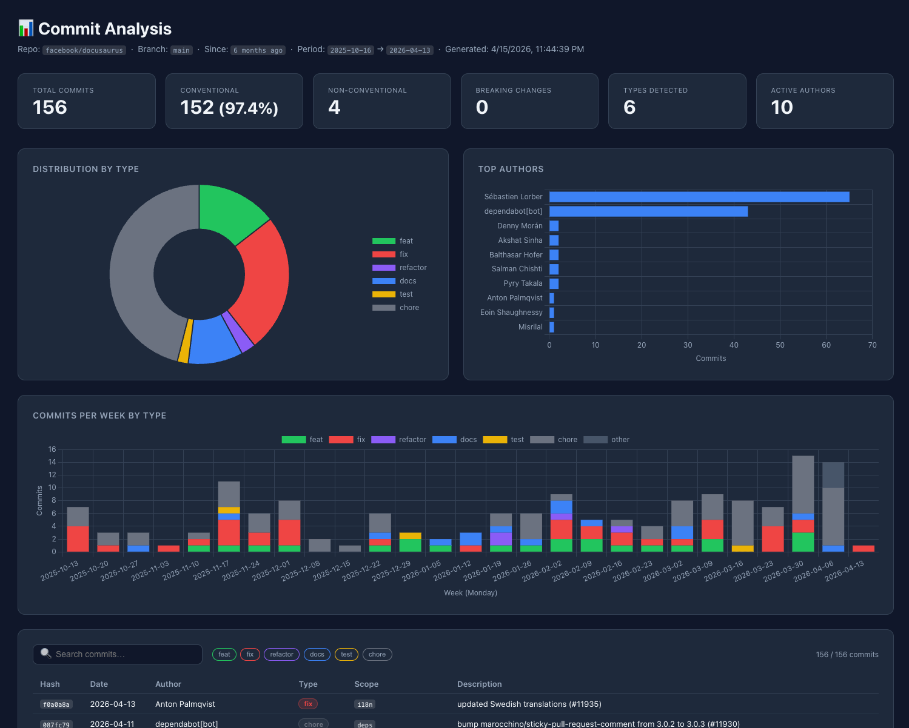

# git-dashboard

<p align="center"></p>

Analyzes conventional commits on a branch, grouping and counting them by type (`feat`, `fix`, `chore`, `docs`, `refactor`, `test`, `perf`, `ci`, `build`, `revert`, …).

Works in two modes:

- **Local** — reads from a git repository in the working directory (no extra setup)
- **Remote** — fetches commits via the GitHub REST API (no local clone needed)

## Dev

From the **Lufa-Lab** monorepo root:

```bash
pnpm install
pnpm --filter git-dashboard start
```

---

## Requirements

- **Node.js >= 18** (uses native `fetch` and ES modules — no install needed)

---

## Usage

```bash
node index.js [options]
```

Or install globally from the monorepo:

```bash
cd packages/web/git-dashboard && npm install -g .
git-dashboard [options]
```

### Local mode options (default)

| Option            | Default        | Description                                  |
| ----------------- | -------------- | -------------------------------------------- |
| `--since <value>` | `3 months ago` | Git `--since` value                          |
| `--branch <ref>`  | `origin/main`  | Branch ref to analyze, e.g. `origin/main`    |
| `--output <dir>`  | `./output`     | Output directory                             |
| `--format <list>` | `json,md,html` | Comma-separated: `json`, `md`, `html`        |
| `--types <list>`  | _(all)_        | Only include specific types, e.g. `feat,fix` |
| `--help`          | —              | Show help                                    |

### Remote mode options (GitHub API — no clone needed)

| Option                            | Default        | Description                                                            |
| --------------------------------- | -------------- | ---------------------------------------------------------------------- |
| `--repo <owner/name>`             | —              | **Required** to enable remote mode, e.g. `facebook/react`             |
| `--branch <name>`                 | `main`         | Branch name (plain, not `origin/…`)                                    |
| `--token <token>`                 | —              | GitHub token; falls back to `GITHUB_TOKEN` env variable                |
| `--since <value>`                 | `3 months ago` | Relative (`3 months ago`) or ISO date (`2024-01-01`)                   |
| `--output`, `--format`, `--types` | same as local  | Same as local mode                                                     |

> **Authentication**: for public repos the token is optional (rate limit: 60 req/h unauthenticated vs 5000/h with token). For private repos the token is required.

### Examples

```bash
# ── Local mode ────────────────────────────────────────────────
# Analyze the last 3 months of origin/main (default)
node index.js
# or, if installed globally:
git-dashboard

# 6 months, specific branch
node index.js --branch origin/main --since "6 months ago"

# Only feat, fix and perf, markdown output only
node index.js --types "feat,fix,perf" --format md

# ── Remote mode ───────────────────────────────────────────────
# Analyze a public repo without cloning it
node index.js --repo facebook/react

# With a specific branch and time range
node index.js --repo facebook/react --branch main --since "6 months ago"

# Authenticated (private repo or higher rate limit)
GITHUB_TOKEN=ghp_xxx node index.js --repo my-org/my-private-repo

# Filter to feat and fix only
node index.js --repo facebook/react --types "feat,fix" --format md
```

---

## npm Scripts

| Script          | Command                                             | Description                                  |
| --------------- | --------------------------------------------------- | -------------------------------------------- |
| `start`         | `node index.js`                                     | Analyze with defaults (last 3 months)        |
| `analyze`       | `node index.js --since '3 months ago'`              | Same as start, explicit                      |
| `analyze:main`  | `node index.js --branch origin/main --since '...'`  | Explicit branch + time range                 |
| `open`          | `node index.js && node serve.mjs`                   | Analyze then open the dashboard in a browser |
| `serve`         | `node serve.mjs`                                    | Serve existing output without re-analyzing   |

---

## Output

| File                          | Description                                       |
| ----------------------------- | ------------------------------------------------- |
| `output/commit-analysis.json` | Full analysis as JSON                             |
| `output/commit-analysis.md`   | Readable report with tables per type              |
| `output/index.html`           | Interactive HTML dashboard (charts + filter table)|

### Markdown report sections

- **Summary** — total / conventional / non-conventional / breaking counts
- **Commits by Type** — table with count, breaking count, and % of conventional commits
- **Top Authors** — top 10 contributors
- **Commit Details** — per-type tables with hash, date, author, scope, description

### HTML dashboard

The HTML dashboard is a self-contained single-page app generated inside `output/index.html`. It includes:

- **KPI cards** — total commits, conventional %, non-conventional, breaking changes, types detected, active authors
- **Charts** — type distribution (doughnut), top authors (bar), commits per week by type (stacked bar)
- **Filterable commit table** — live search + per-type toggle buttons

To view it, run the local server (auto-opens the browser):

```bash
npm run serve
# or: node serve.mjs
# or: node serve.mjs --port 8080
```

> The server only serves files from `output/` and is protected against path traversal.

---

## Conventional Commit Format

This tool follows the [Conventional Commits spec](https://www.conventionalcommits.org/):

```
<type>(<scope>): <description>
<type>!: <description>          ← breaking change
```

Recognized types: `feat`, `fix`, `perf`, `refactor`, `docs`, `test`, `style`, `chore`, `ci`, `build`, `revert`.

Commits that do not match this format are listed separately as **non-conventional**.

---

## Publishing

The package is configured to publish only the files needed at runtime:

```
index.js   ← git-dashboard bin entry point
serve.mjs  ← dashboard HTTP server
lib/       ← core modules (git, github, stats, reporters)
```

`_bmad/`, `scripts/`, `.github/`, `output/` and other dev artefacts are excluded via the `"files"` field in `package.json`.

### Publish to npm

```bash
# Bump the version first
npm version patch   # or minor / major

# Dry-run: inspect what will be included
npm pack --dry-run

# Publish
npm publish
```

`prepublishOnly` runs a quick sanity check to ensure all required files are present before any publish or pack.

### Test the bin locally before publishing

```bash
npm install -g .
git-dashboard --help
```
